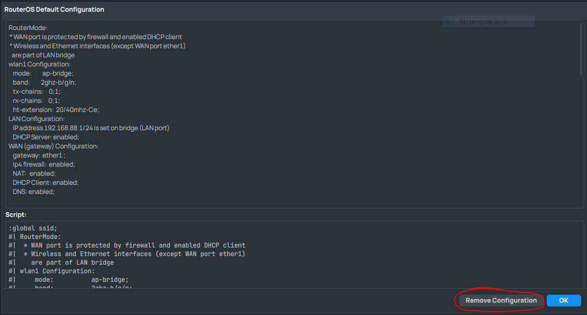
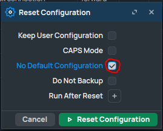

# LAB-3
Selasa 12 Agustus 2025

# Blank Configuration di Mikrotik  
  Untuk mengakses Mikrotik yang blank, kita bisa mengakses melalui ether1. Dan kita harus mengunakan MACAddress untuk login, karna Mikrotik belum memiliki IP. Untuk mendapat blank configuration di Mikrotik ada beberapa cara,  
  **1. Reset Configuration**  
    Reset configuration bisa mendapatkan blank configuration, caranya, dengan men-checklist bagian **No Default Configuration**  
      
  **2. Reset Configuration di tampilan awal**  
    Bisa juga di Reset Configuration saat opo up awal memakai Default Configuration  
      
# Blank konfigurasi  
  Pada konfigurasi blank ini, kita bisa lihat bahwa:  
  **1. Interface WLAN Mati/Disable**  
  **2. Addresses Kosong**
    Jadi untuk login ke Mikrotik harus mengunakan MAC Address, karna IP Addressnya belum di set.
  **3. Firewall kosong**
  **4. Tidak ada interface bridge**
# Tambahan
**Perbedaan Bridge dan Switch**  
  1. Bridge  
     Bridge dapat menggabungkan beberapa interface seolah-olah menjadi satu, yang artinya tidak ada perbedaan segmen. Karna ini bekerja lewat software, ini lebih membebankan ke prosesor Routernya.  
  2. Switch  
     Fungsi switch hanya bisa melakukan penggabungan ethernet interface selama ethernet tersebut masih dalam satu switch chip yang sama. Di switch terdapat Switch chip yang tidak akan membebani prosesor Router.  
# Kesimpulan  
  Blank configuration sangat cocok untuk yang ingin memulai mikrotik bersih/kosong dan bisa mengakses mengunakan ether1 karna belum terkonfigurasi sebagai WAN.  
    
